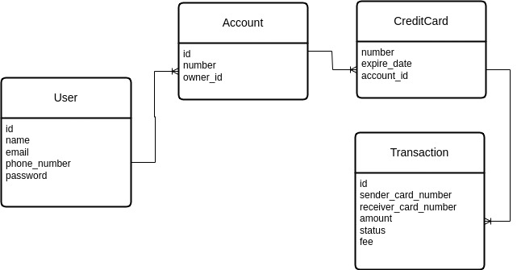

# Transaction manager app

This application manages you bank accounts and cards,
you can do your bank transactions and transfer money
using this app.

**Caution**: you can have an easy start by following 
the [Installation](#install) section instruction.

# Index

Using bellow list you can jump to different
parts of the application.

* [Requirements](#requirements)
* [Commit Message Manual](#commit-message-manual)
* [Make Commands](#make-commands)
  * [Install](#install)
  * [Up](#up)
  * [Down](#down)
  * [Restart](#restart)
  * [Build](#build)
  * [Destroy](#destroy)
  * [Shell](#shell)
  * [Logs](#logs)
  * [Following Logs](#following-logs)
  * [Status](#status)
  * [Run Application Tests](#application-tests)
* [Database Diagram](#database-diagram)
* [Postman Collection](#postman-collection)

# Requirements

This projects uses `docker`, `docker compose`, and the `make` tools
to maintain the development environment.

# Commit Message Manual

The following phrases are in use to perform good commit messages.

* **Added**: the commit contains a feature on the application, like an api is added.
* **Modified**: the commit contains changes, these changes are not bugs,
  like lazy loading is improved.
* **Fixed**: the commit fixes a bug on the application.

# Make Commands

This project uses docker and make to manage the
development progress, so you can use these tools
to develop easily.

Bellow there are different prepared make commands
so you can check the application without any 
specific knowledge needed.

## Install

You can bring up and running the project using this command.
This command will prepare the development environment for you
to do your work.

**Caution**: this command installs the composer packages, creates
the `.env` file, and publishes the needed assets, and finally to
make sure that everything is okay, it will run the application tests.

```shell
make install
```

## Up

You can bring up the application services using
this command like this.

```shell
make up
```

### Specifications

You can bring up the environment with your own
likings using bellow commands.

If you want to specify a command on the container
itself like lunching with a specific user you can 
use this command like this.

```shell
make up up-as="--user root"
```

Currently the project brings up the environment on
detach mode, but you can change it, for example you
may want to remove orphan containers too, like bellow.

```shell
make up up-with="-d --remove-orphans"
```

## Down

You can bring down the containers using bellow command.

```shell
make down
```

### Specifications

You can also do some extra requirements using bellow commands.

```shell
make down down-with="--volumes"
```

## Restart

You can restart the environment like this.

```shell
make restart
```

### Specifications

You can also specify the target service using this command.

```shell
make restart service=web
```

## Build

You can rebuild all containers using this command.

**Caution**: this command is useful when you need to read the
docker files changes once again, in this case the `up` command
on docker compose does not check for having changes on using
docker files.

```shell
make build
```

## Destroy

You can stop and remove the whole running environment 
including network and volumes from you computer like 
this.

```shell
make destroy
```

## shell

You can get into the `backend` container using this command.

```shell
make shell
```

### Specifications

If you need to get into another container you can do it like this.

```shell
make shell service=web run=ash
```

**Caution**: the `run` parameter is there because the web image
is an alpine image and you need to run `ash` instead of `bash`,
which is the default `run` value.

You can also change the running command of this command like this.

```shell
make shell run="php artisan tinker"
```

## Logs

You can view the logs like this.

```shell
make logs
```

### Specifications

You can define the container which you need to view the logs of like this.

```shell
make logs service=backend
```

## Following Logs

You can follow and view the runtime logs using this command.

```shell
make logs.follow
```

### Specifications

You can define the container which you need to view the logs of like this.

```shell
make logs.follow service=backend
```

## Status

You can check the status of running containers like this.

```shell
make status
```

or

```shell
make ps
```

## Application Tests

You can run whole written tests of the application using this command.

```shell
make test
```

# Database Diagram

You can look at the implemented database diagram in bellow.



# Postman Collection

You can try the services by importing and using this postman collection.

[Postman Collection](.assets/TransactionManager.postman_collection.json)